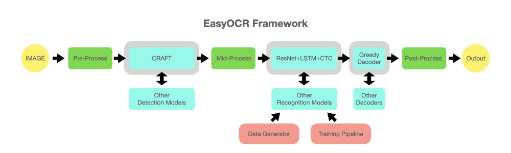

<h1>Optical Character Recognition (OCR)</h1>

<b>OCR</b> is a technology that recognizes text within a digital image. It is commonly used to recognize text in scanned documents and images. OCR software can be used to convert a physical paper document, or an image into an accessible electronic version with text.

<h2>Easyocr</h2>
<b>EasyOCR</b> is lightweight model which is giving a good performance for receipt or PDF conversion. It is giving more accurate results with organized texts like pdf files, receipts and bills, with 80+ supported languages and all popular writing scripts including: Latin, Chinese, Arabic, Devanagari, Cyrillic, etc.. 

 

<h2>EASYOCR Setup:</h2>
<code>!pip install easyocr</code>

<h2>Usage</h2>
<code>import easyocr </code>
 <code>reader = easyocr.Reader(['ar','en']) # this needs to run only once to load the model into memory</code>
 <code>result = reader.readtext('arabic.jpg')</code>

