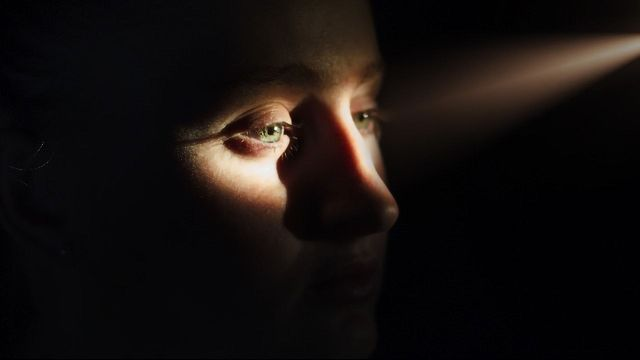

<h1>Make Me See</h1>

The project aims to help the people that suffer from sight problems whether if they have Visual impairment or Dyslexic.

<h1>The project is consists of:</h1>
<ol>
<li> OCR.</li>
It is a technology that recognizes text within a digital image.
<li> Image captioning.</li>
Is the process of generating a textual description of an image.
<li> Object detection and Recognition.</li>
Recognizing, identifying, and locating objects within a picture with a given degree of confidence.
</ol>

